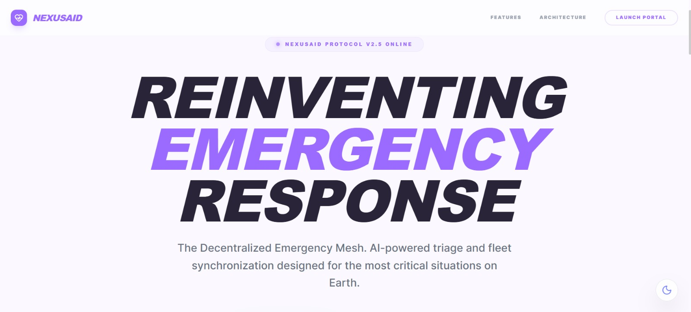
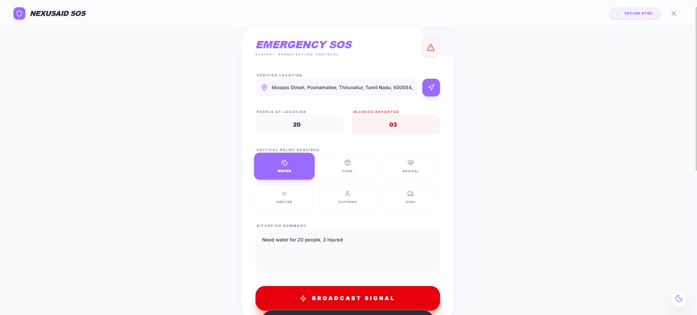
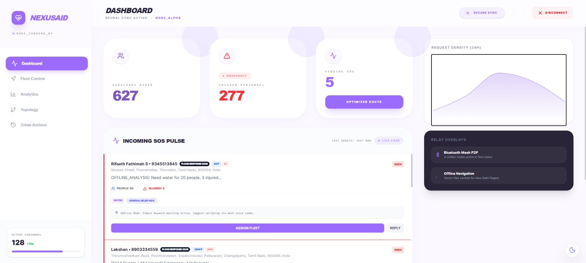

# NexusAid

AI-powered decentralized disaster response system that works even without internet.

Nexusaid is an intelligent disaster response system that enables real-time communication between victims and NGOs. It uses AI to process emergency requests, prioritize needs, and ensure efficient resource allocation—even in low connectivity environments.

## 🌐 Live Demo

https://nexusaid-65070.web.app/

## Problem Statement
During disasters, communication systems often fail, leading to delayed response, poor coordination, and inefficient distribution of resources. Victims are unable to convey their needs effectively, while NGOs struggle to identify priorities and allocate resources in real time.
## Solution

Nexusaid provides a platform where victims can send emergency requests through simple text inputs. The system uses AI to analyze and structure the request, identify urgency, and match it with the most suitable NGO. It also supports decentralized communication concepts for low-connectivity scenarios.
## Features

- SMS-based emergency communication
- AI-powered request analysis (Google Gemini)
- Urgency detection & prioritization
- NGO specialization matching
- Smart resource allocation
- Works in low/no network conditions

## AI Integration
Nexusaid integrates Google Gemini via Google AI Studio to process unstructured emergency inputs.

The AI model:

- Extracts resource requirements
- Identifies number of affected individuals
- Determines urgency level
- Converts raw text into structured, actionable data
## How it works
1. Victim submits an emergency request
2. AI processes the input using Gemini
3. Extracts key details (resources, urgency, people count)
4. Matches the request with relevant NGO
5. NGO receives structured information and responds
## Usage / Example

1. User (victim) sends an emergency request:
   Example: "Need water for 10 people, 2 injured"

2. The system processes the message using Google Gemini

3. AI extracts:
   - Resources needed
   - Number of people
   - Urgency level

4. The request is categorized and matched with the appropriate NGO

5. NGO receives structured information and takes action

### Example Output

{
  "resources": ["water"],

  "people_count": "10",

  "injured_count": "2",

  "urgency": "HIGH",

  "category": "Medical",

  "recommended_ngo": "Medical NGO",
  
  "summary": "10 people need water with 2 injured requiring urgent attention."
}

## 📸 Screenshots

### 🟢 Home Page

### 🔵 Emergency Input

### 🔴 AI Output

## Tech Stack
**Core Framework & Language**
- React 19: The primary UI framework, leveraging functional components and hooks for state management.
- TypeScript: Ensures type safety and better developer experience across the complex data structures of the "Crisis Core."
- Vite: Used as the lightning-fast build tool and development server.

**Backend & Real-time Integration**
- Firebase (v12):
- Firestore: Handles all real-time data syncing for SOS requests, GPS fleet positions, and task assignments.
- Auth: Manages secure access codes for NGO and Developer command centers.

**Artificial Intelligence**
- Google Gemini API: Powering the parseEmergencySMS service, which converts raw victim input into structured situational intelligence (urgency assessment, resource extraction, and summaries).

**Mapping & Geospatial**
- Leaflet & React-Leaflet: The engine for the interactive fleet control map.
- Leaflet Routing Machine: Used for calculating and visualizing optimized relief paths between NGO bases and victims.

**Data Visualization**
- D3.js: powers the "Physical Mesh" Topology graph, a force-directed layout that visualizes the connections between the NGO base, relief units, and survivors.
- Recharts: Handles the analytical charts for API latency, survivor trends, and resource utilization.

**Design & Motion**
- Tailwind CSS 4.0: Used for all styling, including the glassmorphic "Nexus" aesthetic and responsive layouts.
- Framer Motion: Adds fluid, high-performance animations for route transitions and emergency status pulse effects.
- Lucide React: A comprehensive library of lightweight icons used throughout the dashboard.
## Deployment

The application is deployed using *Firebase* Hosting.

🔗 Live Demo: 
https://nexusaid-65070.web.app/

## Impact
- Faster emergency response
- Efficient resource utilization
- Works without internet
- Saves lives during disasters
## Future Scope
- Developing a dedicated mobile application (iOS & Android) using Flutter or React Native to provide field researchers with real-time, on-the-go access to Nexus analytics.

- Integrate AI-based priority ranking to identify the most critical cases (elderly, injured, children) and respond faster.

- Enable multi-language voice input/output for victims who can’t type or speak a common language.

- Implement data verification & fraud detection to ensure requests are genuine and resources aren’t misused.

- Include volunteer coordination system for task assignment, check-ins, and safety tracking.
## Run Locally

1. Clone the repository
2. Install dependencies
3. Run the development server
4. Build the project for production

## 🧪 Try It Yourself

Visit the live demo and test with:
- "Need food for 15 people"
- "Medical help needed for 5 injured"
## 👥 Authors

- Lakshan M – Team Lead 
  - [GitHub](https://github.com/lakshan2906) | [LinkedIn](https://www.linkedin.com/in/lakshan-manikandan-8b516037a)

- Mythili R – Member 1
  - [LinkedIn](https://www.linkedin.com/in/mythili-r-21052007m/)

- Unni krishnan M – Member 2
  - [LinkedIn](https://www.linkedin.com/in/unni-krishnan-b32259382/)

- Rifaath Fathimah S – Member 3
  - [GitHub](https://github.com/HappyRF) | [LinkedIn](https://www.linkedin.com/in/rifaath-fathimah)
## 🙏 Acknowledgements

- [Google AI Studio](https://aistudio.google.com/) – for building and prototyping the application  
- [Google Gemini](https://deepmind.google/technologies/gemini/) – for AI-powered natural language processing  
- [GitHub](https://github.com/) – for version control and project hosting  
- GDG Solution Challenge – for providing the platform to build impactful solutions  
